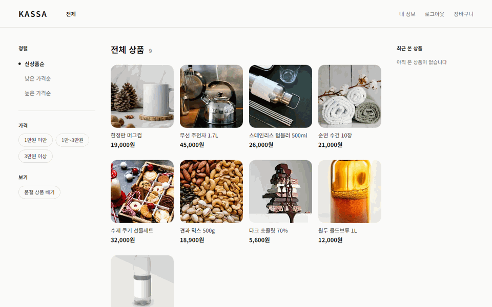
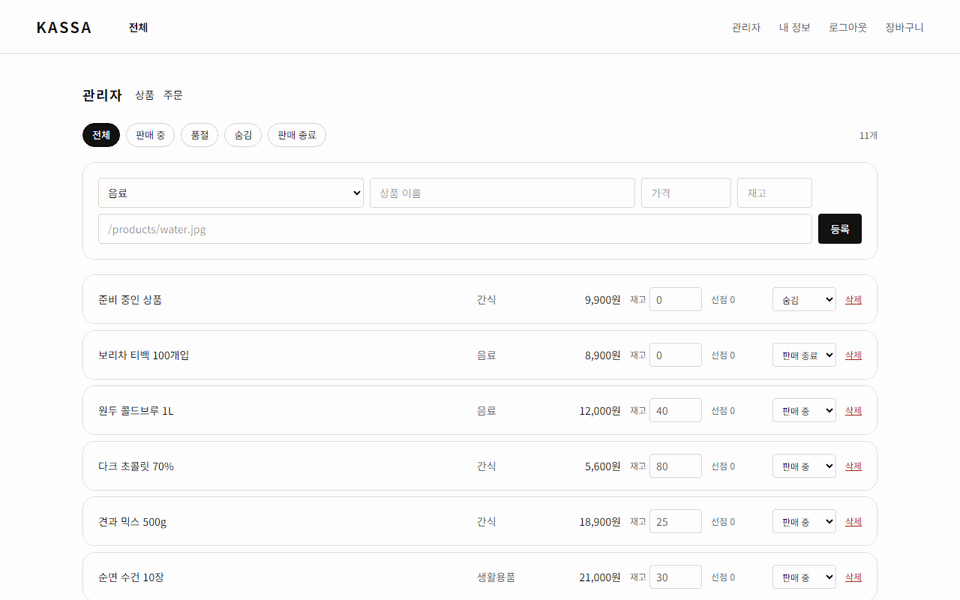

# Kassa

결제 연동을 중심에 둔 쇼핑몰
승인이 늦게 끝나도, 웹훅이 안 와도, 취소가 실패해도 주문·재고·결제가 어긋나지 않게

[](https://github.com/musqat/kassa/actions/workflows/backend.yml)
[](https://github.com/musqat/kassa/actions/workflows/frontend.yml)
[](https://github.com/musqat/kassa/actions/workflows/e2e.yml)

<br>

상품 조회부터 장바구니, 주문과 재고 선점, 토스페이먼츠 결제창 승인과 취소까지 돈다.

<br>

## 화면

<details>
<summary><b>회원 — 상품을 담아 주문하고 결제한다</b></summary>

<br>



</details>

<details>
<summary><b>관리자 — 상품을 등록·판매 종료하고 주문을 배송 처리한다</b></summary>

<br>



</details>

<br>

## 결제가 어긋나지 않게

돈이 오가는 구간은 실패하는 방식이 여러 가지다. 대행사가 거절할 수도 있고, 응답이 아예 안 올 수도 있고,
승인은 됐는데 우리 쪽 저장이 실패할 수도 있다. 각각 해야 할 일이 다르다.

**승인은 사가로 묶는다.** 대행사 승인과 주문 확정을 한 단계씩 실행하고 `saga_instance`·`saga_step` 에 기록한다.
단계마다 새 트랜잭션으로 커밋해서 중간에 죽어도 어디까지 갔는지 남는다. 뒷단계가 실패하면 앞단계를 역순으로 되돌린다.

**멱등키는 대행사를 부르기 전에 저장한다.** 재시도는 같은 키를 보낸다. 대행사가 같은 요청으로 보고 먼저 준 결과를 다시 준다.

**결과가 닿는 길이 넷이다.** 뒤로 갈수록 느리고 확실하다.

| 경로 | 언제 |
|---|---|
| 승인 응답 | 즉시 |
| 웹훅 | 몇 초~몇 분. 본문을 믿지 않고 조회로 다시 확인한다 |
| 결과 확인 스케줄러 | 3분 넘게 결과를 모르는 결제를 대행사에 묻는다 |
| 기록 대조 배치 | 다음 날 새벽. 어긋난 건을 목록으로 남긴다 |

**응답이 없으면 되돌리지 않는다.** 승인 여부를 모르는데 취소를 부르면 멀쩡한 결제가 날아간다.
사가를 `RUNNING` 으로 두고, 확인 스케줄러가 결과를 정한 뒤 복구 스케줄러가 이어받는다.

**한 주문에 승인된 결제는 하나다.** `UNIQUE (order_id) WHERE status = 'PAID'` 로 DB 가 막는다.

**재고는 두 칸으로 나눈다.** 주문할 때 `reserved_stock` 에 선점하고, 결제가 확정되면 `stock` 에서 뺀다.
결제 전에 접은 주문은 선점만 풀고, 결제된 주문을 취소하면 `stock` 을 되돌린다.

<br>

## 구조

<details>
<summary><b>디렉터리</b></summary>

<br>

```
kassa/
├── backend/    Kotlin · Spring Boot 4 · JPA · Flyway
│   └── src/main/kotlin/com/kassa/
│       ├── catalog/       상품
│       ├── user/          회원·인증
│       ├── cart/          장바구니
│       ├── order/         주문·재고
│       ├── payment/       결제
│       │   ├── gateway/     대행사 경계. 토스 구현체와 가짜 구현체
│       │   ├── inbox/       웹훅 수신과 처리
│       │   ├── reconcile/   기록 대조
│       │   └── service/     사전 등록, 결과 확인, 취소
│       ├── saga/          승인 사가와 복구
│       ├── admin/         관리자 상품·주문
│       ├── pricing/       배송비 정책
│       └── common/
│           ├── error/       에러 코드와 ProblemDetail 응답
│           ├── crypto/      전화번호 암호화
│           ├── security/    JWT
│           ├── trace/       요청 추적 아이디
│           └── config/      CORS
└── frontend/   Next.js 16 · Tailwind 4
    ├── src/
    │   ├── app/           라우트
    │   ├── components/    UI
    │   └── lib/           API 클라이언트, 포맷
    └── e2e/               브라우저 흐름 테스트
```

</details>

**에러 응답** — RFC 9457 `ProblemDetail` 에 자체 코드 `code` 와 `requestId` 를 얹는다.

**요청 추적** — 요청마다 식별자를 만들어 응답 헤더 `X-Request-Id`, 로그, 에러 응답에 같은 값으로 넣는다.

<details>
<summary><b>API</b></summary>

<br>

전체 목록과 요청·응답 모양은 Swagger UI 에서 본다. 로컬은 http://localhost:8080/swagger-ui.html, 문서 원본은 `/v3/api-docs`.

| 묶음 | 내용 |
|---|---|
| 상품 | 목록, 단건 |
| 회원 | 가입, 아이디 중복확인, 내 정보, 탈퇴 |
| 인증 | 로그인, 이메일 인증·재전송, 아이디 찾기, 비밀번호 재설정 |
| 장바구니 | 담기, 수량 변경, 빼기, 조회 |
| 주문 | 생성, 목록, 단건, 취소 |
| 결제 | 승인, 웹훅 수신 |
| 관리자 상품 | 목록, 등록, 수정, 재고, 상태, 삭제, 분류 목록 |
| 관리자 주문 | 목록, 단건, 배송 처리 |

자물쇠 버튼에 로그인으로 받은 토큰을 넣으면 인증이 필요한 API 도 화면에서 호출할 수 있다.
관리자 API 는 토큰의 권한이 `ADMIN` 일 때만 열린다. 관리자 계정은 `ADMIN_LOGIN_ID`·`ADMIN_EMAIL`·`ADMIN_PASSWORD` 가 다 있을 때 기동하며 한 번 만든다.

승인 응답은 셋이다. 성공은 `200`, 대행사가 거절하면 `409 PAY_003`, 응답이 없으면 `202` 로 주문 상태를 돌려준다.

```json
{
  "status": 404,
  "title": "Not Found",
  "detail": "상품을 찾을 수 없습니다",
  "instance": "/api/products/99999",
  "code": "CATALOG_001",
  "requestId": "a1b2c3d4"
}
```

</details>

<br>

## 기술 스택

| 영역 | 기술 |
|---|---|
| Backend | Kotlin 2.3 · Spring Boot 4.1 · Spring Data JPA · Flyway |
| Frontend | Next.js 16 · React 19 · TypeScript · Tailwind CSS 4 |
| Data | PostgreSQL 17 |
| 결제 | 토스페이먼츠 |
| Test | JUnit 5 · MockMvc · Testcontainers · Playwright |
| CI | GitHub Actions |

<br>

## 테스트

백엔드 **258 개**, E2E **8 개**. 통합 테스트는 Testcontainers 로 PostgreSQL 17 을 띄운다.

실패 경로를 가짜 게이트웨이로 만든다. 승인 거절, 응답 없음, 금액 불일치, 취소 실패를 골라 둘 수 있어서
보상과 복구가 도는지 테스트에서 확인한다.

실제 토스를 부르는 테스트는 `toss` 태그로 갈라 두고 `./gradlew tossTest` 로만 돌린다.

화면 흐름은 Playwright 로 확인한다. 가입·메일 인증·로그인, 담기부터 결제·취소까지, 관리자의 상품 등록·판매 종료와 권한 확인까지 브라우저로 돌린다.
계정은 테스트마다 새로 만들어서 DB 를 비우지 않고 반복해서 돌릴 수 있다.

도커와 백엔드를 띄워 두고 `frontend` 에서 `npm run e2e` 로 돌린다. 프런트는 Playwright 가 직접 띄운다.

CI 는 PR 과 `main` push 마다 백엔드와 프런트를 빌드하고 테스트한다. E2E 도 같이 돈다.

<br>

## 로컬에서 실행

<details>
<summary><b>실행 방법</b></summary>

<br>

Docker, JDK 21, Node 20 이상이 필요하다.

```bash
docker compose up -d
```

PostgreSQL 이 호스트 5433, 메일 확인용 Mailpit 이 8025 로 뜬다.

```bash
cd backend
./gradlew bootRun
```

```bash
cd frontend
npm install
npm run dev
```

http://localhost:3000 에서 상품 목록이 나온다. 테스트는 `backend` 에서 `./gradlew test` 이고,
Docker 가 켜져 있어야 한다.

결제는 기본값이 가짜 게이트웨이다. 결제 화면에서 승인 결과를 직접 고른다.
토스로 붙이려면 `PAYMENT_GATEWAY=toss` 와 `TOSS_SECRET_KEY` 를 넣고 띄운다.

</details>
